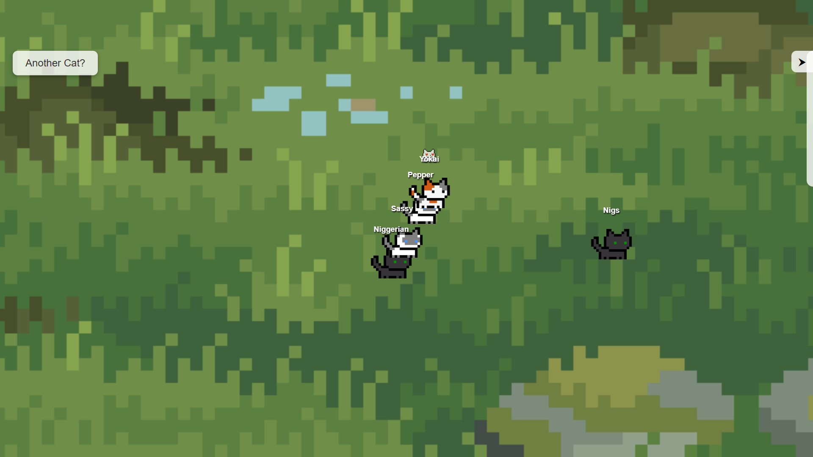

# 🐾 Cat Land

Welcome to **Cat Land** — an interactive browser-based playground where adorable animated cats come to life! 🎉

Users can add cats, name them, drag them around, watch them fall in love, and even interact with a quirky dashboard called the **Pawnel** 🐾✨.



---

## 🎮 Features

- 🐱 Choose from multiple cat types (white, black, orange, calico, and more)
- ✏️ Name or rename your cats anytime
- 🧠 Cats move randomly, follow your cursor or other cats
- 💗 Heart animations when cats meet
- 🖱️ Drag and drop cats anywhere
- 📋 Toggleable **Meownitor** (Dashboard) listing all your named cats

---

## 🚀 Getting Started

To try out Cat Land locally:

```bash
git clone https://github.com/mashi-20/Project001-CatLand.git
cd Project001-CatLand
open index.html   # or use Live Server in VS Code
